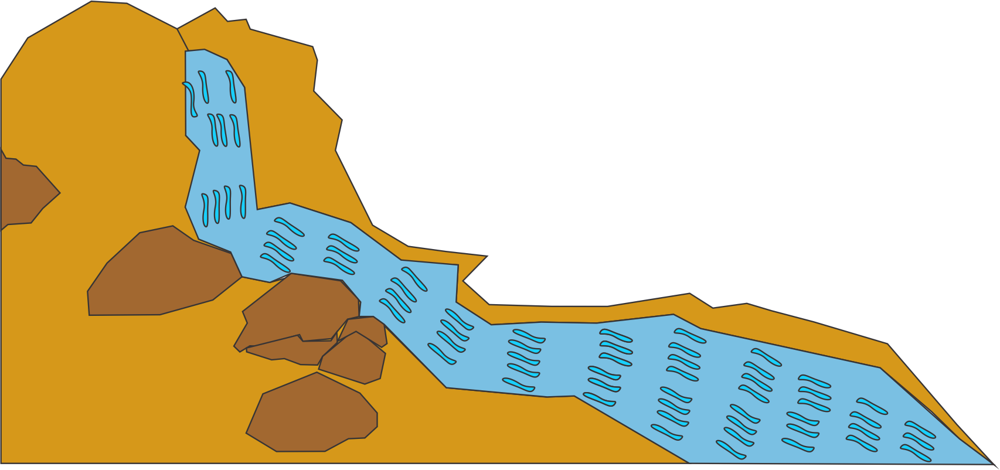

# Quem sou eu?

Meu nome é João Kennedy Oliveira da Silva, tenho 18 anos sou um estudante do curso de programação de jogos digitais Campos Ceará-Mirim, embora nós somos desenvolvedores de jogos, cada pessoa tem as suas peculiaridades e preferencias, nós programamos animamos e ainda temos a parte de game disigner maias minha preferência é a parte de animação.

## Jogos

todos os jogos foram criados na disciplina de oficina ministrada pelo professor **Marcelo Mesmo** com a parceria dos meus amigos tanto na programação quanto na animação,  **Jefferson Leocardo,  Guilherme Eglé e  Julio Cesar souza** nos jogos que seram mostrados a seguir .

* Mais rápido que a música 

* Pense se você puder

* Entregue se puder

## Artes
Estas são as artes feitas por mim, que foram colocadas nos jogos ministrados pela disciplinas do professor de motores e animação **Durval pacheco**.

O personagem foi criado para a ilustração do jogo **entregue se puder**, em conjunto com as outras imagens, "celular e imagem jogo, que já é a tela de entrada do meu jogo.

As artes do leão, arvore, cobra e do rio foram ciradas para o o tabalho de animação do professor **Durval Pacheco.**

* * *

## Contatos

Email: Joaokennedy_@outlook.com.br  
Gmail: kennedyjoao1999@gmail.com  
Facebook: Kennedy Oliveira

* * *
