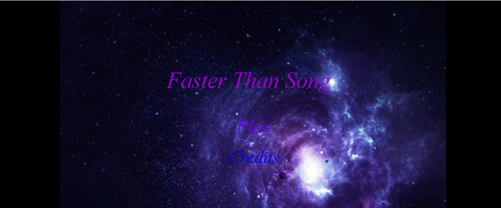
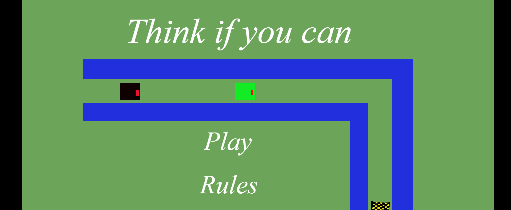
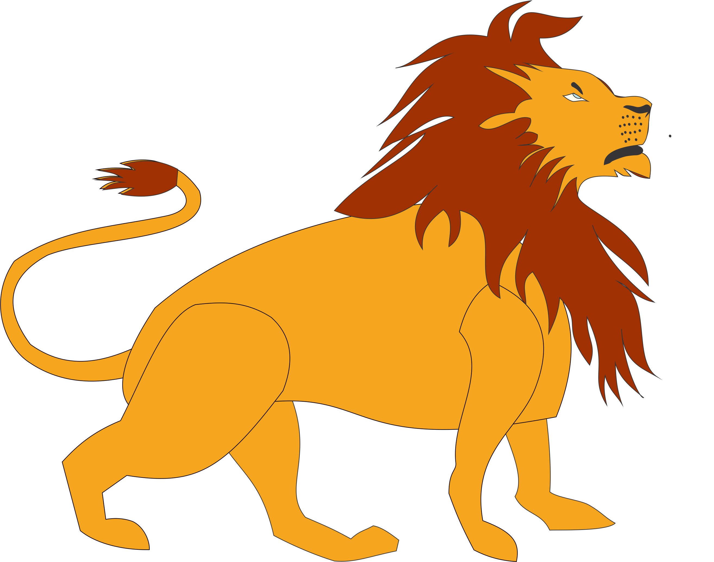
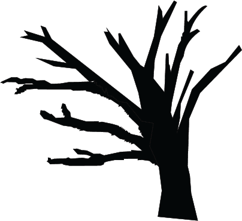
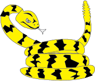

# Quem sou eu?

Meu nome é João Kennedy Oliveira da Silva, tenho 18 anos sou um estudante do curso de programação de jogos digitais Campos Ceará-Mirim, embora nós somos desenvolvedores de jogos, cada pessoa tem as suas peculiaridades e preferencias, nós programamos animamos e ainda temos a parte de game disigner maias minha preferência é a parte de animação.

## Jogos

todos os jogos foram criados na disciplina de oficina ministrada pelo professor **Marcelo Mesmo** com a parceria dos meus amigos programadores e animadores,  **Jefferson Leocardo,  Guilherme Eglé e  Julio Cesar souza**.

* Mais rápido que a música 

* Pense se você puder

* Entregue se puder

## artes
estas são as artes feitas por mim, que foram colocadas nos jogos ministrados pela disciplinas de motores e animação.

* * *

** negrito    
_ italico    
~~ riscado    

#s uma ou mais  hastags cria capítulos ou sub capitulos

* * *

Atualizacao 23/02
